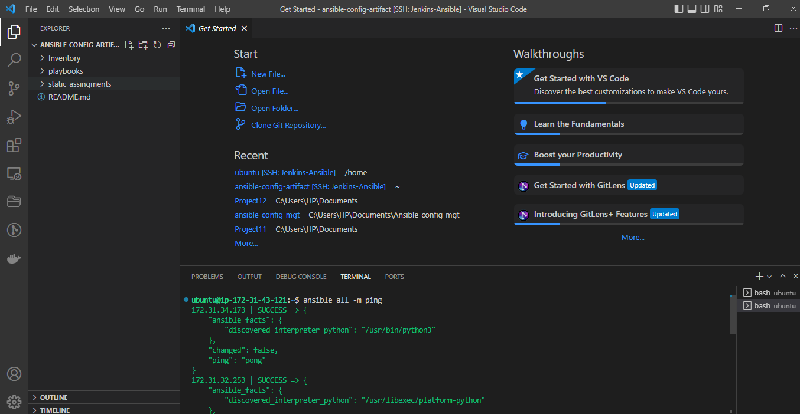
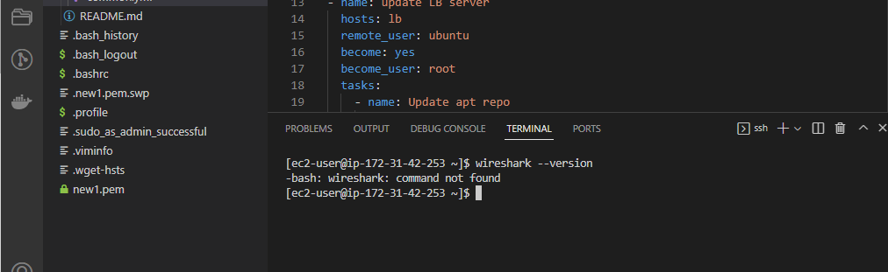
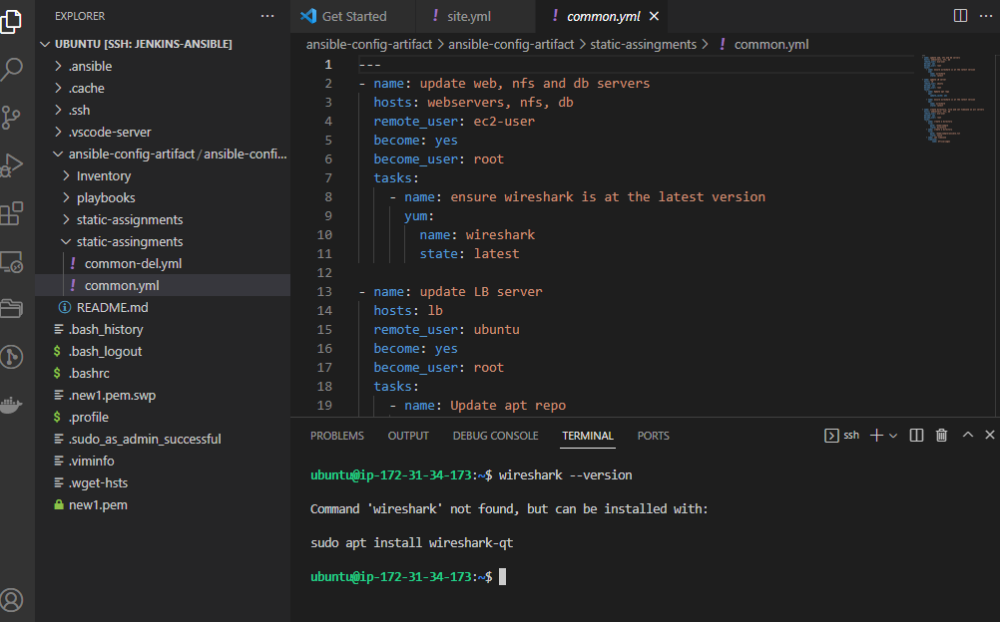

**ANSIBLE REFACTORING AND STATIC ASSIGNMENTS (IMPORTS AND ROLES)**

**Step 1 – Jenkins job enhancement**

- Before we begin, let us make some changes to our Jenkins job – now every new change in the codes creates a separate directory which is not very convenient when we want to run some commands from one place. Besides, it consumes space on Jenkins serves with each subsequent change. Let us enhance it by introducing a new Jenkins project/job – we will require Copy Artifact plugin.

1. Go to your Jenkins-Ansible server and create a new directory called ansible-config-artifact – we will store there all artifacts after each build
`sudo mkdir /home/ubuntu/ansible-config-artifact`
2. Change permissions to this directory, so Jenkins could save files there
`sudo chmod -R 0777 /home/ubuntu/ansible-config-artifact`

3. Go to Jenkins web console -> Manage Jenkins -> Manage Plugins -> on Available tab search for Copy Artifact and install this plugin without restarting Jenkins

4. Create a new Freestyle project and name it save_artifacts.
5. This project will be triggered by completion of your existing ansible project. Configure it accordingly

- Note: You can configure number of builds to keep in order to save space on the server, for example, you might want to keep only last 2 or 5 build results. You can also make this change to your ansible job.

6. The main idea of save_artifacts project is to save artifacts into /home/ubuntu/ansible-config-artifact directory. To achieve this, create a Build step and choose Copy artifacts from other project, specify ansible as a source project and /home/ubuntu/ansible-config-artifact as a target directory.

7. Test your set up by making some change in README.MD file inside your ansible-config-mgt repository (right inside master branch)

- In other for this build to suceed we have to set permissions on our /var/lib/jenkins/workspace directory:
- `cd /var/lib/jenkins/workspace`
- `sudo mkdir ansible-config-artifact`
- `sudo chmod -R 777 ansible-config-artifact`
- `sudo chown -R jenkins:jenkins ansible-config-artifact`

- We can verify our files have been copied on our terminal
- `cd /var/lib/jenkins/workspace`
- `cd ansible-config-artifact`
- `ls`

**Step 2 – Refactor Ansible code by importing other playbooks into site.yml**

- Before starting to refactor the codes, ensure that you have pulled down the latest code from master (main) branch, and created a new branch, name it refactor.
- `git checkout -b refactor`

1. Within playbooks folder, create a new file and name it site.yml – This file will now be considered as an entry point into the entire infrastructure configuration. Other playbooks will be included here as a reference. In other words, site.yml will become a parent to all other playbooks that will be developed. Including common.yml that you created previously.

2. Create a new folder in root of the repository and name it static-assignments. The static-assignments folder is where all other children playbooks will be stored

- `mkdir static-assingments.yml`

3. Move common.yml file into the newly created static-assignments folder.
4. Inside site.yml file, import common.yml playbook.

- `---`
- `hosts: all`
- `import_playbook: ../static-assignments/common.yml`
  
- Your folder structure should look like this;

5. Run ansible-playbook command against the dev environment

- Since you need to apply some tasks to your dev servers and wireshark is already installed – you can go ahead and create another playbook under static-assignments and name it common-del.yml. In this playbook, configure deletion of wireshark utility.

- `---`
- `name: update web, nfs and db servers`
  `hosts: webservers, nfs, db`
  `remote_user: ec2-user`
  `become: yes`
  `become_user: root`
  `tasks:`
  - `name: delete wireshark`
    `yum:`
      `name: wireshark`
      `state: removed`

- `name: update LB server`
  `hosts: lb`
  `remote_user: ubuntu`
  `become: yes`
  `become_user: root`
  `tasks:`
  - `name: delete wireshark`
    `apt:`
      `name: wireshark-qt`
      `state: absent`
      `autoremove: yes`
      `purge: yes`
      `autoclean: yes`

- update `site.yml` with - `import_playbook: ../static-assignments/common-del.yml` instead of `common.yml` and run it against dev servers:

- Before we run our playbook Now we need to push these changes to our repository ,so our jenkins-ansible server will be updated.

- We also need to configure our ansible to read our inventory file before we run our playbooks
- `cd inventory`
- `pwd` copy the directory
- `sudo vi /etc/ansible/ansible.cfg`
- paste the inventory file path on the file ,then uncomment it .

- Now test if our ansible is able to ping our servers
- `ansible all -m ping`

- Now run our playbook
- `cd /home/ubuntu/ansible-config-artifact`
- `ansible-playbook -i inventory/dev.yml playbooks/site.yml`

- Make sure that wireshark is deleted on all the servers by running
- `wireshark --version`

**Step 3 – Configure UAT Webservers with a role ‘Webserver'**

- We have our nice and clean dev environment, so let us put it aside and configure 2 new Web Servers as uat. We could write tasks to configure Web Servers in the same playbook, but it would be too messy, instead, we will use a dedicated role to make our configuration reusable.

1. Launch 2 fresh EC2 instances using RHEL 8 image, we will use them as our uat servers, so give them names accordingly – Web1-UAT and Web2-UAT.

2. To create a role, you must create a directory called roles/, relative to the playbook file or in /etc/ansible/ directory.

- There are two ways how you can create this folder structure:

- Use an Ansible utility called ansible-galaxy inside ansible-config-mgt/roles directory (you need to create roles directory upfront)
- `mkdir roles`
- `cd roles`
- `ansible-galaxy init webserver`
- Create the directory/files structure manually

- Note: You can choose either way, but since you store all your codes in GitHub, it is recommended to create folders and files there rather than locally on Jenkins-Ansible server.

3. on our branch (refactor) create a folder and name it 'webserver'

- The directory structure should look like this.

-  Update your inventory ansible-config-mgt/inventory/uat.yml file with IP addresses of your 2 UAT Web servers

`[uat-webservers]`
`Web1-UAT-Server-Private-IP-Address` `ansible_ssh_user='ec2-user'`

`Web2-UAT-Server-Private-IP-Address` `ansible_ssh_user='ec2-user'`

4. In /etc/ansible/ansible.cfg file uncomment roles_path string and provide a full path to your roles directory `roles_path`    `= /home/ubuntu/ansible-config-artifact/roles`, so Ansible could know where to find configured roles.

- `sudo vi /etc/ansible/ansible.cfg`
- uncomment and paste `/home/ubuntu/ansible-config-artifact/roles`

5. It is time to start adding some logic to the webserver role. Go into tasks directory, and within the main.yml file, start writing configuration tasks to do the following:

- Install and configure Apache (httpd service)
- Clone Tooling website from GitHub `https://github.com/your-name/tooling.git`.
- Ensure the tooling website code is deployed to /var/www/html on each of 2 UAT Web servers.
- Make sure httpd service is started
- Your main.yml may consist of following tasks:

---

- `name: install apache`
  `become: true`
  `ansible.builtin.yum:`
    `name: "httpd"`
    `state: present`

- `name: install git`
  `become: true`
  `ansible.builtin.yum:`
    `name: "git"`
    `state: present`

- `name: clone a repo`
  `become: true`
  `ansible.builtin.git:`
    `repo: https://github.com` `your-name/tooling.git`
    `dest`: `/var/www/html`
    `force`: `yes`

- `name`: `copy html content to one level up`
  `become`: `true`
  `command`: `cp -r /var/www/html/html/ /var/www/`

-`name`: `Start service` `httpd`, `if not started`
  `become`: `true`
  `ansible`.`builtin.service:`
    `name`: `httpd`
    `state`: `started`

- `name`: `recursively remove``/var/www/html/html``directory`
  `become`: `true`
  `ansible.builtin.file:`
    `path: /var/www/html/html`
    `state: absent`

**Step 4 – Reference ‘Webserver’ role**

- Within the static-assignments folder, create a new assignment for uat-webservers uat-webservers.yml. This is where you will reference the role.

`---`

- `hosts: uat-webservers`
  `roles:`
  - `webserver`

- Remember that the entry point to our ansible configuration is the site.yml file. Therefore, you need to refer your uat-webservers.yml role inside site.yml.

- So, we should have this in site.yml

`---`
 `hosts: all`
 `import_playbook: ../``static-assignments/common.yml`

 `hosts: uat-webservers`
  `import_playbook: ../static-assignments/``uat-webservers.yml`
  

- Now we update our main branch and push changes to your repo
- Our jenkins-ansible server should look like this

**Step 5 – Commit & Test**

- Commit your changes, create a Pull Request and merge them to master branch, make sure webhook triggered two consequent Jenkins jobs, they ran successfully and copied all the files to your Jenkins-Ansible server into /home/ubuntu/ansible-config-artifact/ directory

- Now run the playbook against your uat inventory and see what happens:

- `cd ansible-config-artifact`
- `ansible-playbook -i Inventory/uat.yml playbooks/site.yml`

- You should be able to see both of your UAT Web servers configured and you can try to reach them from your browser

`http://Web1-UAT-Server-Public-IP-or-Public-DNS-Name/index.php`

or

`http://Web1-UAT-Server-Public-IP-or-Public-DNS-Name/index.php`

**Congratulations!**
**You have learned how to deploy and configure UAT Web Servers using Ansible imports and roles!**
